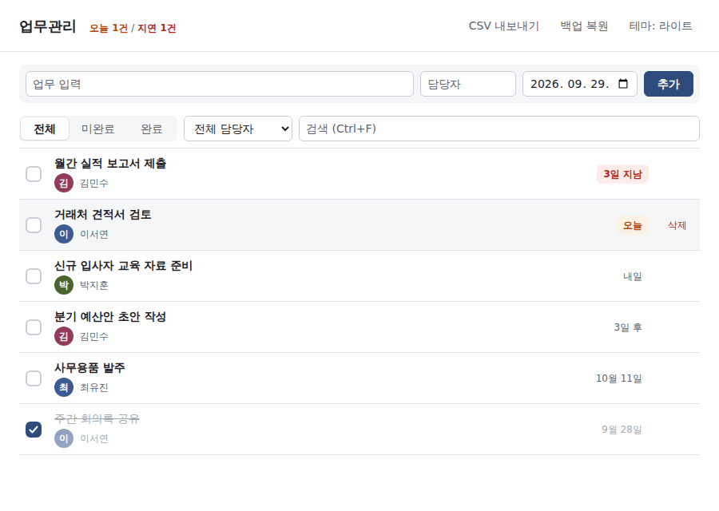
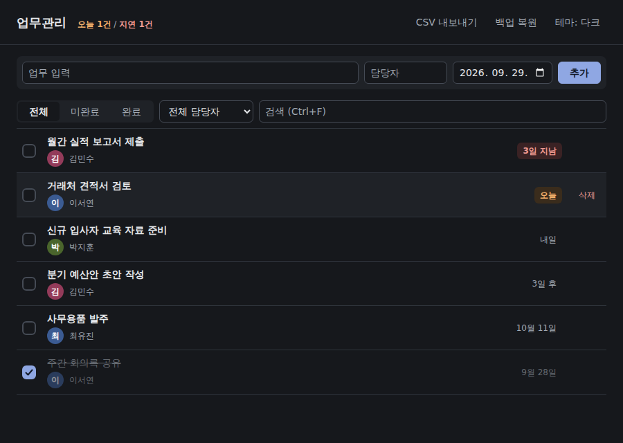
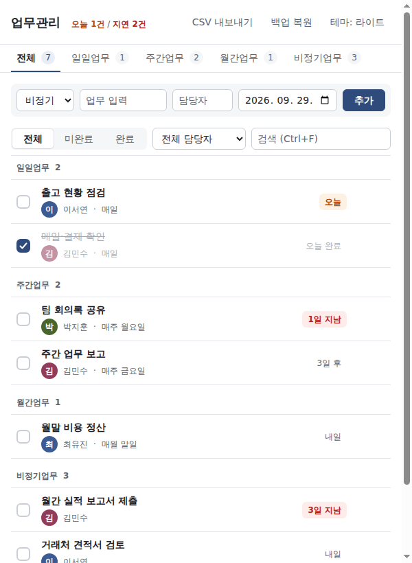
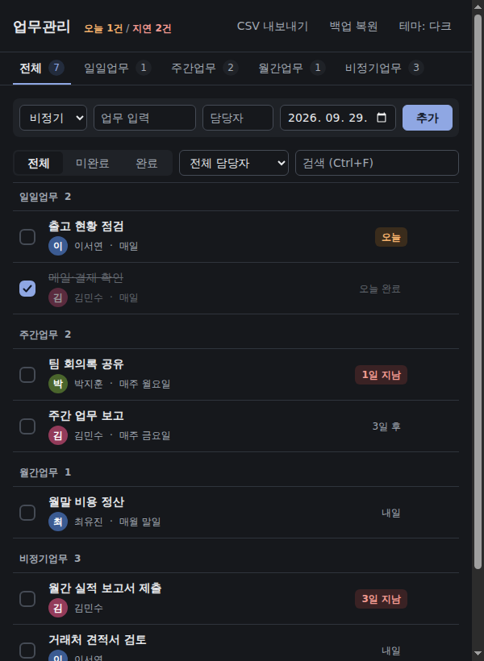

# 업무관리

Windows용 개인 업무 체크리스트 프로그램입니다. **업무 입력 → 담당자 → 마감일 → 체크**만으로 쓰고, 입력하는 즉시 자동 저장됩니다. 인터넷 연결 없이 동작합니다.



## 다운로드

**[최신 버전 받기 (GitHub Releases)](https://github.com/dzap12312-droid/task-manager/releases/latest)**

Releases 페이지의 **Assets**에서 둘 중 하나를 받으세요.

| 파일 | 종류 | 이런 분께 | 데이터 저장 위치 |
|---|---|---|---|
| `TaskManager-Setup-1.2.0.exe` | 설치형 | 내 PC에서 계속 쓸 때. 바탕화면·시작 메뉴에 아이콘이 생깁니다. | `%APPDATA%\업무관리\` |
| `TaskManager-1.2.0-Portable.exe` | 포터블 | 설치 없이 USB나 원하는 폴더에서 바로 실행할 때 | exe 옆 `data\` 폴더 |

- 설치형은 새 버전을 설치해도 기존 데이터가 그대로 유지됩니다. 프로그램을 제거해도 데이터는 지워지지 않습니다.
- 포터블은 exe와 같은 폴더의 `data\`에 저장하므로, **exe와 `data` 폴더를 함께** 옮기면 다른 PC에서도 그대로 이어서 쓸 수 있습니다.
- v1.1 포터블을 쓰던 분은 v1.2 포터블을 처음 실행할 때 기존 데이터(`%APPDATA%\업무관리\tasks.json`)가 `data\`로 **자동 복사**됩니다. 원본은 지우지 않습니다.

### "Windows의 PC 보호" (SmartScreen) 경고가 뜰 때

이 프로그램은 코드 서명 인증서가 없어서, 처음 실행하면 파란 경고 창이 뜰 수 있습니다.

1. 경고 창에서 **추가 정보**를 누릅니다.
2. 아래에 생긴 **실행** 버튼을 누릅니다.

한 번 실행하면 다음부터는 경고가 뜨지 않습니다. 회사 PC에서 실행 자체가 막혀 있다면 IT 담당자에게 문의하세요.

## 화면

| 라이트 | 다크 |
|---|---|
|  |  |
|  |  |

## 사용법

- **업무 추가**: 업무·담당자·날짜를 입력하고 `Enter` (날짜를 비우면 오늘). 추가 후에도 담당자는 그대로 남아 연속 입력이 편합니다.
- **완료**: 왼쪽 체크박스. 완료하면 흐리게 + 취소선으로 바뀌고 완료일이 기록됩니다.
- **마감 표시**: 지난 업무는 빨강(`3일 지남`), 오늘 마감은 주황(`오늘`). 상단에 `오늘 N건 / 지연 N건` 요약이 나오고, 프로그램을 켤 때 해당 업무가 있으면 Windows 알림이 한 번 뜹니다.
- **찾기**: 상태 탭(전체/미완료/완료), 담당자 선택, 검색창(업무명·담당자 실시간 검색)을 함께 쓸 수 있습니다.
- **CSV 내보내기**: 지금 화면에 보이는 목록(필터·검색 적용)을 엑셀에서 한글이 깨지지 않는 CSV로 저장합니다. 열: 업무 / 담당자 / 날짜 / 완료여부 / 완료일.
- **백업 복원**: 프로그램을 켤 때마다 자동으로 백업됩니다(내용이 바뀐 경우에만, 최근 30개 보관). `백업 복원`에서 원하는 시점을 골라 되돌릴 수 있고, 복원 직전 데이터도 자동으로 백업됩니다.
- **테마**: Windows 설정(라이트/다크)을 자동으로 따릅니다. `테마` 버튼으로 시스템 → 라이트 → 다크를 직접 고를 수 있고, 선택은 저장됩니다.
- **삭제**: 행에 마우스를 올리면 오른쪽에 `삭제` 버튼이 나타납니다(확인 후 삭제).

### 단축키

| 키 | 동작 |
|---|---|
| `Enter` | 업무 추가 |
| `Ctrl` + `F` | 검색창으로 이동 |
| `Esc` | 입력 중인 내용 지우기 (검색창에서는 검색어 지우기) |

## 데이터 저장 위치와 옮기기

| 파일 | 설명 |
|---|---|
| `tasks.json` | 업무 데이터 |
| `backups\tasks-<시각>.json` | 자동 백업 (최근 30개) |
| `settings.json` | 테마 설정 |
| `tasks.broken-<시각>.json` | 데이터 파일이 손상됐을 때 보존해 둔 원본 |

- 설치형: 탐색기 주소창에 `%APPDATA%\업무관리`를 입력하면 바로 열립니다.
- 포터블: exe가 있는 폴더의 `data\`
- 다른 PC로 옮기기: 위 폴더의 `tasks.json`을 새 PC의 같은 위치에 복사합니다. `백업 복원` 창의 **백업 폴더 열기**로도 바로 찾아갈 수 있습니다.

## CHANGELOG

### v1.2.0 (2026-09-29)

**새 기능**
- CSV 내보내기: 현재 필터·검색이 적용된 목록, UTF-8 BOM(엑셀 한글 정상), 열 업무/담당자/날짜/완료여부/완료일
- 마감 관리: 지연 업무 빨강, 오늘 마감 주황, 상단 `오늘 N건 / 지연 N건` 요약, 시작 시 Windows 알림 1회
- 백업 복원: 시작 시 자동 백업(최근 30개), 목록에서 골라 복원(복원 전 현재 데이터 자동 백업)
- 포터블 exe는 exe 옆 `data\` 폴더에 저장(기존 데이터 1회 자동 복사), 설치형은 `%APPDATA%` 유지
- 검색창(업무명·담당자 실시간 검색), 담당자 필터를 선택 상자로 변경
- 완료일(`completedAt`) 기록 — 기존 `tasks.json`은 그대로 읽힘(필드 추가만)
- 다크 모드(Windows 설정 자동 + 수동 전환, 선택 저장)
- 단축키: `Enter` 추가, `Ctrl+F` 검색, `Esc` 입력 취소

**디자인**
- 차분한 업무용 디자인: 흰 배경 + 연회색 면 + 남색 포인트, 8px 간격, 글자 크기 3단계
- 업무 행: 큰 체크박스, 굵은 업무명, 담당자 이니셜 원형 뱃지(이름별 색), `오늘/내일/3일 지남` 상대 날짜
- 완료 시 흐림·취소선 0.15초 전환, 삭제 버튼은 마우스를 올릴 때만 표시
- 창 최소 폭 600px, 모든 글자 색 대비 WCAG AA(4.5:1) 이상

**안정성·보안**
- 동시에 여러 번 저장할 때 파일이 꼬일 수 있던 문제 수정(저장 순서 보장)
- Windows에서 백신 등이 파일을 잡고 있을 때 저장 재시도
- 메모장으로 편집해 BOM이 붙은 `tasks.json`도 정상 인식
- 보안 정책(CSP) 강화, 외부 페이지 이동·새 창 차단, 저장 데이터 검증, CSV 수식 주입 방지
- 개발 실행 시 개발자 도구가 자동으로 열리던 동작 제거(`--devtools`로만 열림)
- exe 파일 이름을 영문으로 변경(`TaskManager-Setup-*.exe`, `TaskManager-*-Portable.exe`) — 앱 이름·데이터 위치는 그대로

### v1.1

- 업무 추가/완료/삭제, 담당자·상태 필터, 자동 저장(안전한 쓰기, 손상 파일 보존), 설치형·포터블 exe, 바탕화면 바로가기 스크립트

---

## 개발자용

### 준비

- [Node.js](https://nodejs.org) 22 이상
- Windows에서 exe 빌드(`npm run dist`)

### 실행

```bash
npm ci
npm start              # 개발 실행
npm start -- --devtools  # 개발자 도구와 함께 실행
```

Node.js만 설치된 PC라면 `run.bat` 더블클릭으로도 실행됩니다(최초 1회 자동 설치). `create_shortcut.bat`을 실행하면 바탕화면 아이콘이 생깁니다.

### 테스트

```bash
npm test               # 단위 테스트 (node --test)
npm run test:e2e       # Electron 화면 E2E (Playwright)
# Linux 서버: xvfb-run -a npm run test:e2e
npm run screenshots    # docs/screenshots 갱신 (가상 데이터 사용)
```

E2E와 스크린샷은 환경 변수 `TASK_MANAGER_DATA_DIR`로 지정한 임시 폴더만 사용하므로 실제 업무 데이터에 영향이 없습니다.

### 빌드 / 릴리스

```bash
npm run dist           # dist\TaskManager-Setup-<버전>.exe, dist\TaskManager-<버전>-Portable.exe
```

`package.json`의 `version`을 올리고 README의 CHANGELOG에 `### v<버전>` 항목을 추가한 뒤 `v<버전>` 태그를 push하면, GitHub Actions(`.github/workflows/release.yml`)가 Windows에서 `npm ci → npm test → npm run dist`를 실행하고 두 exe를 Release에 첨부합니다. 릴리스 노트는 CHANGELOG의 해당 버전 항목에서 가져옵니다.

> `productName`(`업무관리`)과 `build.appId`는 바꾸지 마세요. 데이터 폴더(`%APPDATA%\업무관리`)와 설치 정보가 여기에 묶여 있어, 바꾸면 기존 데이터가 보이지 않거나 프로그램이 두 번 설치됩니다.

### 폴더 구조

```
main.js            창 생성, IPC, 데이터 경로·백업·알림·테마
preload.js         window.api (contextBridge)
src/
  store.js         tasks.json 안전 저장/로드 (tmp → rename, 저장 순서 보장)
  backup.js        자동 백업, 목록, 복원
  paths.js         데이터 폴더 결정(포터블/설치형), v1.1 데이터 이전
  settings.js      테마 설정
  validate.js      저장 데이터 검증
renderer/
  index.html       화면 구조(CSP 적용)
  style.css        디자인(:root 색 변수, 다크 모드)
  logic.js         정렬/필터/검색/마감/상대 날짜/CSV 순수 함수 (렌더러 + 테스트 공용)
  app.js           화면 동작
test/              *.test.js 단위 테스트, e2e.spec.js Electron E2E
scripts/           screenshots.js
assets/icon.ico
```

### 데이터 형식 (`tasks.json`)

```json
[
  { "id": 1727600000000, "assignee": "홍길동", "task": "주간 보고서 작성", "date": "2026-09-29", "completed": true, "completedAt": "2026-09-29" }
]
```

`completedAt`은 v1.2에서 추가된 필드이며, 없는 데이터(v1.1)도 그대로 읽힙니다.

## 라이선스

[MIT](LICENSE)
